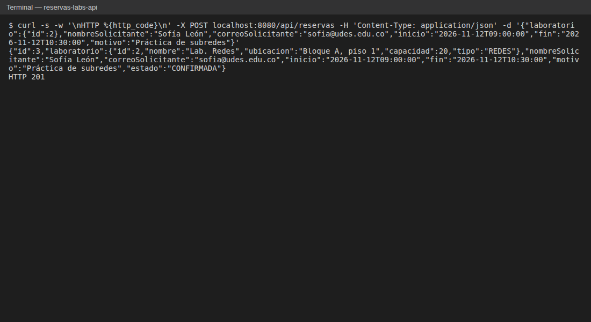
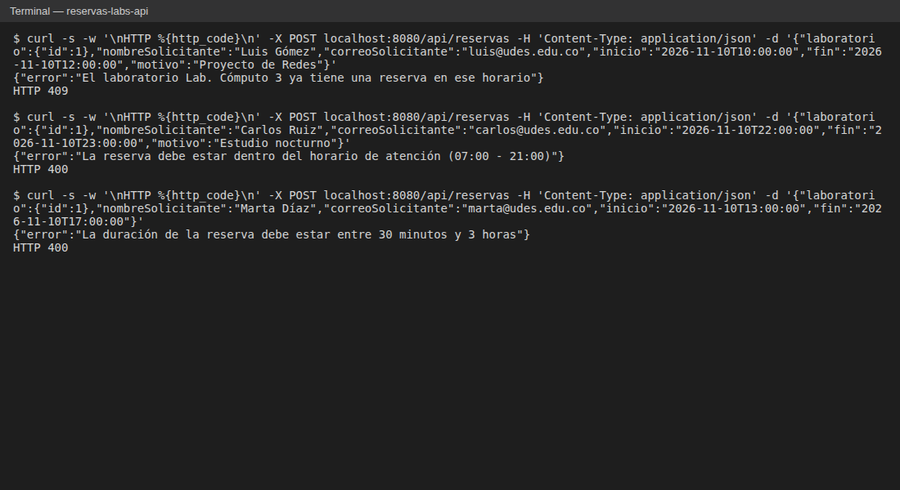
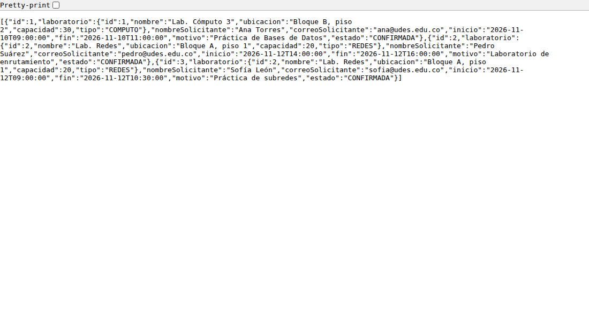
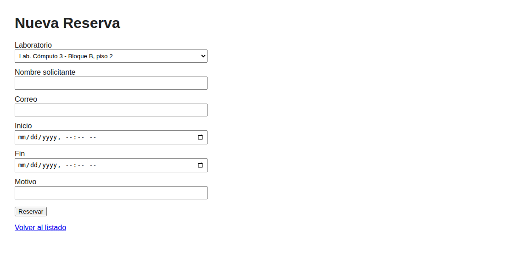
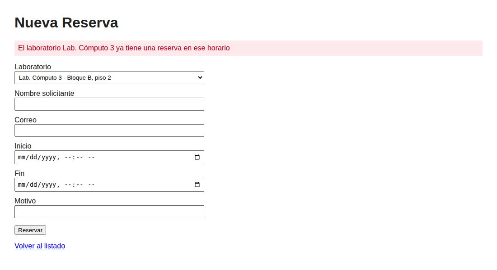
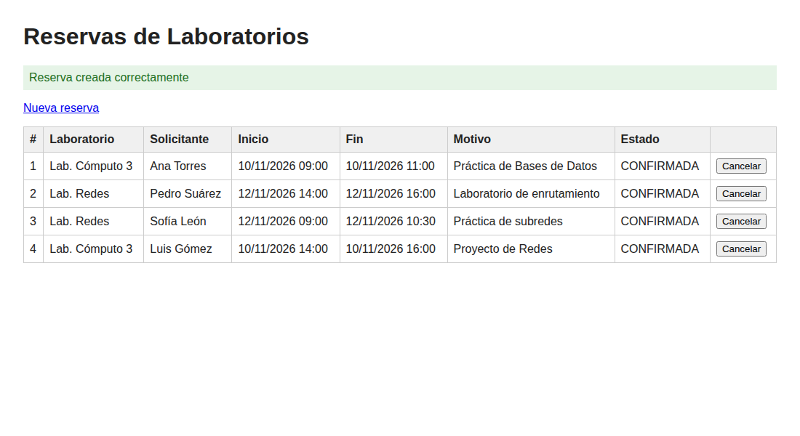
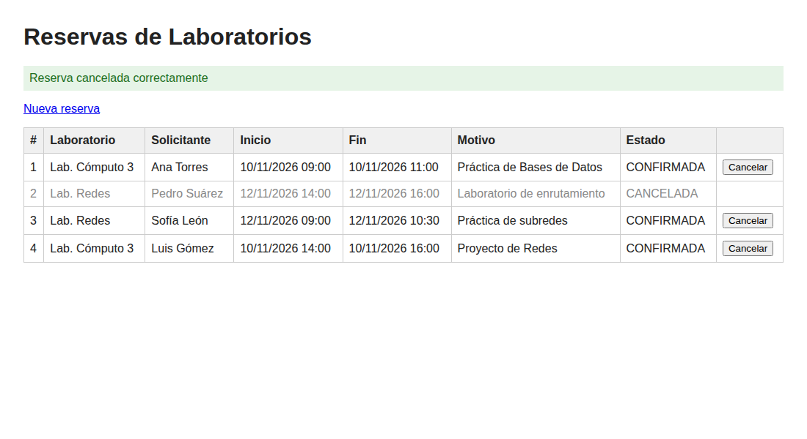
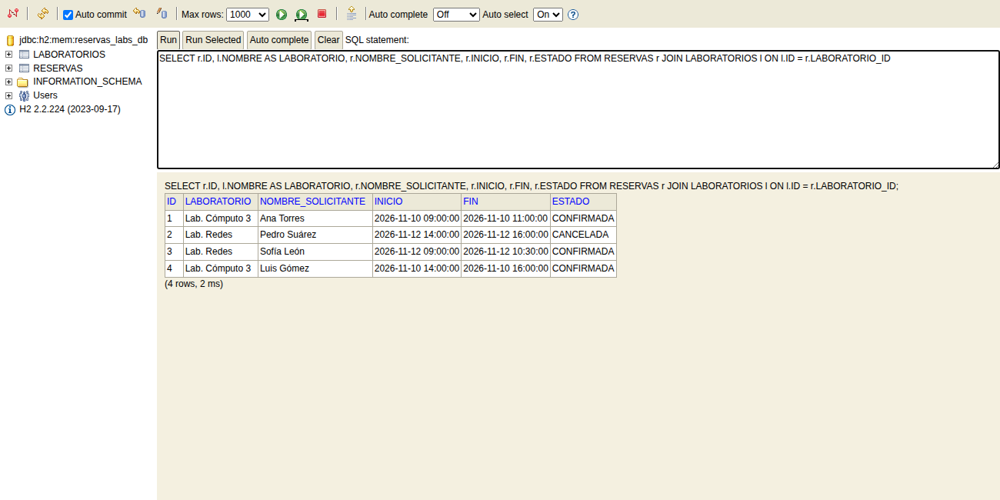

# Post-contenido — Unidad 5: Integración en Aplicaciones Web
## Link del repo: 
## Descripción
Repositorio del post-contenido de la Unidad 5 de Patrones de Diseño de
Software. Un único proyecto Spring Boot (`reservas-labs-api`) para la
reserva de laboratorios de cómputo de la universidad, donde estudiantes y
docentes reservan un laboratorio en un horario específico para una práctica
o un proyecto. Tiene dos partes: una API REST en capas (Entity, Repository,
Service, Controller) sobre H2, y una vista Thymeleaf (MVC clásico) que
reutiliza el mismo Service.

```
             Navegador (HTML)                  Cliente REST (JSON)
                    |                                  |
        web/ReservaWebController          controller/ReservaController
        web/ReservaWebExceptionHandler    exception/GlobalRestExceptionHandler
                    \                                  /
                     +------ service/ReservaService ---+
                                     |
                repository/ReservaRepository, LaboratorioRepository
                                     |
                               H2 (en memoria)
```

## Parte 1 — Repository, Service y Controller REST

Arquitectura en capas dentro de `com.universidad.reservaslabs`:

| Paquete | Contenido | Responsabilidad |
|---|---|---|
| `model/` | `Laboratorio`, `Reserva`, `EstadoReserva` | Entidades JPA y restricciones de formato (Bean Validation). |
| `repository/` | `LaboratorioRepository`, `ReservaRepository` | Acceso a datos con Spring Data JPA. `ReservaRepository` agrega la consulta JPQL `buscarSolapamientos`. |
| `service/` | `ReservaService` | Reglas de negocio: solapamiento, horario de atención, duración y cancelación. |
| `exception/` | `ReservaConflictException`, `ReservaInvalidaException`, `RecursoNoEncontradoException`, `GlobalRestExceptionHandler` | Vocabulario de errores de dominio y su traducción a HTTP. |
| `controller/` | `LaboratorioController`, `ReservaController` | Endpoints REST; no contienen reglas de negocio. |

### Reglas de negocio de `ReservaService`
1. La reserva debe iniciar y terminar el mismo día, dentro del horario de atención (07:00 - 21:00) y durar entre 30 minutos y 3 horas.
2. No se puede reservar un laboratorio en un horario que se solape con otra reserva activa (no cancelada) del mismo laboratorio.
3. No se puede cancelar una reserva cuyo horario de inicio ya pasó, ni una reserva que ya está cancelada.

### Endpoints REST

| Método | Ruta | Respuesta |
|---|---|---|
| GET | `/api/laboratorios` | Lista de laboratorios |
| GET | `/api/laboratorios/{id}` | 200 o 404 |
| POST | `/api/laboratorios` | 201 o 400 si falla la validación |
| GET | `/api/reservas` | Lista de reservas |
| GET | `/api/reservas/{id}` | 200 o 404 |
| GET | `/api/reservas/laboratorio/{laboratorioId}` | Reservas del laboratorio o 404 |
| POST | `/api/reservas` | 201, 400 (datos o horario inválidos), 404 (laboratorio inexistente), 409 (solapamiento) |
| DELETE | `/api/reservas/{id}` | 204, 404 o 409 (ya cancelada o ya inició) |

Mapeo de excepciones en `GlobalRestExceptionHandler`:

| Excepción | Código | Cuándo |
|---|---|---|
| `ReservaInvalidaException` | 400 | La reserva es inválida por sí misma (rango, horario, duración). |
| `MethodArgumentNotValidException` | 400 | Falla una anotación de Bean Validation (`@NotBlank`, `@Email`...). |
| `RecursoNoEncontradoException` | 404 | El laboratorio o la reserva no existen. |
| `ReservaConflictException` | 409 | La reserva choca con datos existentes (solapamiento, cancelación no permitida). |

## Parte 2 — Vista MVC con Thymeleaf

`ReservaWebController` (paquete `web/`, anotado con `@Controller`) expone
`/reservas` y devuelve vistas Thymeleaf de `templates/reservas/`. Recibe por
constructor la misma clase `ReservaService` que usa la API REST, así que no
existe un Service duplicado para la vista. `ReservaWebExceptionHandler`
maneja las mismas excepciones de dominio que `GlobalRestExceptionHandler`,
pero las presenta como una redirección con un mensaje en la página en lugar
de un cuerpo JSON.

| Método | Ruta | Descripción |
|---|---|---|
| GET | `/reservas` | Lista de reservas con mensaje de éxito o error. |
| GET | `/reservas/nueva` | Formulario con el combo de laboratorios cargado desde la base de datos. |
| POST | `/reservas` | Crea la reserva. Si hay errores de formato se vuelve a mostrar el formulario con los mensajes por campo; si falla una regla de negocio redirige al formulario con el mensaje. |
| POST | `/reservas/{id}/cancelar` | Cancela la reserva y vuelve al listado con el resultado. |

## Cómo ejecutar
Requisitos: Java 17 o superior y Maven 3.8+.

```
mvn clean package
mvn spring-boot:run
```

- API REST: http://localhost:8080/api/reservas
- Vista MVC: http://localhost:8080/reservas
- Consola H2: http://localhost:8080/h2-console (JDBC URL `jdbc:h2:mem:reservas_labs_db`, usuario `sa`, sin contraseña)

La base de datos arranca vacía: antes de usar el formulario hay que crear
al menos un laboratorio con `POST /api/laboratorios` (ver ejemplo abajo).

Pruebas (unitarias del Service y de integración de la vista MVC y la API):

```
mvn test
...
Tests run: 14, Failures: 0, Errors: 0, Skipped: 0
```

### Verificación con curl

```
$ curl -X POST localhost:8080/api/laboratorios -H 'Content-Type: application/json' \
  -d '{"nombre":"Lab. Cómputo 3","ubicacion":"Bloque B, piso 2","capacidad":30,"tipo":"COMPUTO"}'
{"id":1,"nombre":"Lab. Cómputo 3","ubicacion":"Bloque B, piso 2","capacidad":30,"tipo":"COMPUTO"}
HTTP 201

$ curl -X POST localhost:8080/api/reservas -H 'Content-Type: application/json' \
  -d '{"laboratorio":{"id":1},"nombreSolicitante":"Ana Torres","correoSolicitante":"ana@udes.edu.co","inicio":"2026-11-10T09:00:00","fin":"2026-11-10T11:00:00","motivo":"Práctica de Bases de Datos"}'
{"id":1,"laboratorio":{"id":1,...},"nombreSolicitante":"Ana Torres",...,"estado":"CONFIRMADA"}
HTTP 201

# Mismo laboratorio, horario solapado
$ curl -X POST localhost:8080/api/reservas -H 'Content-Type: application/json' \
  -d '{"laboratorio":{"id":1},"nombreSolicitante":"Luis Gómez","correoSolicitante":"luis@udes.edu.co","inicio":"2026-11-10T10:00:00","fin":"2026-11-10T12:00:00","motivo":"Proyecto de Redes"}'
{"error":"El laboratorio Lab. Cómputo 3 ya tiene una reserva en ese horario"}
HTTP 409

# Fuera del horario de atención
$ curl -X POST localhost:8080/api/reservas -H 'Content-Type: application/json' \
  -d '{"laboratorio":{"id":1},"nombreSolicitante":"Carlos Ruiz","correoSolicitante":"carlos@udes.edu.co","inicio":"2026-11-10T22:00:00","fin":"2026-11-10T23:00:00","motivo":"Estudio nocturno"}'
{"error":"La reserva debe estar dentro del horario de atención (07:00 - 21:00)"}
HTTP 400

# Duración mayor a 3 horas
{"error":"La duración de la reserva debe estar entre 30 minutos y 3 horas"}
HTTP 400

# Campos con formato inválido
{"errores":["correoSolicitante: El correo del solicitante debe ser válido","nombreSolicitante: El nombre del solicitante no puede estar vacío"]}
HTTP 400

# Cancelar dos veces la misma reserva
$ curl -X DELETE localhost:8080/api/reservas/1      -> HTTP 204
$ curl -X DELETE localhost:8080/api/reservas/1      -> {"error":"La reserva 1 ya se encuentra cancelada"} HTTP 409
```

## Decisiones de diseño

### Punto de decisión 1 — Ubicación de la validación de solapamiento
La validación se reparte en dos capas, cada una respondiendo una pregunta
distinta:

- `ReservaRepository.buscarSolapamientos` responde una **pregunta de datos**:
  "¿qué reservas activas de este laboratorio se cruzan con el rango
  `[inicio, fin)`?". La condición `r.inicio < :fin AND r.fin > :inicio` se
  evalúa en la base de datos, así que solo viajan a memoria las filas en
  conflicto (normalmente cero o una).
- `ReservaService.crear` responde la **pregunta de negocio**: "¿se permite
  crear esta reserva?". Si la lista no está vacía lanza
  `ReservaConflictException` con un mensaje para el usuario.

La alternativa descartada era traer con `findByLaboratorioId` todas las
reservas del laboratorio y comparar los rangos en Java. Funciona igual con
pocos datos, pero el costo crece con cada semestre de reservas acumuladas y
se terminaría cargando en memoria todo el historial para responder un sí o
un no. Tampoco tenía sentido lo contrario, que el Repository lanzara la
excepción: el Repository no debe saber qué mensaje mostrar ni qué es un
"conflicto" para el negocio.

Si el Controller llamara directamente a `buscarSolapamientos()` sin pasar
por el Service, la regla quedaría escrita en la capa HTTP: cada nuevo punto
de entrada (otro endpoint, la vista web, un proceso batch) tendría que
repetirla, y bastaría con olvidarla en uno solo para permitir dobles
reservas. Además se perdería la transacción de `ReservaService`, que agrupa
la consulta de solapamientos y el `save` en una misma unidad de trabajo.

### Punto de decisión 2 — Reglas con y sin apoyo del Repository
`validarHorarioYDuracion` vive completa en `ReservaService` y no toca el
Repository, porque solo necesita los campos `inicio` y `fin` de la reserva
que se está creando. Consultar la base de datos para eso sería un viaje
innecesario y acoplaría una regla puramente de dominio a la persistencia;
además, como es Java puro, se prueba sin base de datos (ver
`ReservaServiceTest`, donde se verifica que una reserva fuera de horario ni
siquiera llega a consultar solapamientos).

El criterio general que seguí:

- Si la regla necesita comparar contra datos que solo la base de datos
  conoce (otras reservas ya guardadas), me apoyo en una consulta del
  Repository que filtre en SQL, y el Service decide con el resultado.
- Si la regla depende únicamente del objeto que se está validando, va en el
  Service con Java puro y no involucra al Repository.

Ese mismo criterio separa las dos excepciones: lo que falla por sí mismo es
`ReservaInvalidaException` (400, el cliente envió algo mal) y lo que falla al
compararse con otros datos es `ReservaConflictException` (409, la petición es
correcta pero choca con el estado actual). Las validaciones de formato
(`@NotBlank`, `@Email`, `@NotNull`) se quedan en la entidad con Bean
Validation porque no son reglas de negocio sino forma de los datos.

### Laboratorios sin capa Service
`LaboratorioController` usa `LaboratorioRepository` directamente. Es una
excepción intencional: el catálogo de laboratorios es un CRUD sin reglas
propias, y un `LaboratorioService` con métodos como
`save(l) { return repo.save(l); }` sería exactamente el Service anémico que
se busca evitar. La capa Service se agrega cuando hay una regla que la
justifique, como ocurre con las reservas, y no por seguir la plantilla de
capas de forma mecánica. Si más adelante aparece una regla (por ejemplo, no
repetir nombres de laboratorio), ese sería el momento de introducirla.

### Punto de decisión 3 — Cómo comparten Service el Controller MVC y el REST
Los dos controladores declaran una dependencia de tipo `ReservaService` y la
reciben por constructor:

- `controller/ReservaController.java`, líneas 15 y 17:
  `public ReservaController(ReservaService service)`
- `web/ReservaWebController.java`, líneas 19 y 22:
  `public ReservaWebController(ReservaService service, LaboratorioRepository laboratorioRepo)`

Spring crea un único bean singleton de `ReservaService`, de modo que ambos
reciben la misma instancia. Ningún controlador repite la validación de
solapamiento, horario, duración o cancelación: `ReservaWebController` solo
traduce el formulario a una `Reserva`, llama a `service.crear(...)` o
`service.cancelar(...)` y decide a qué vista ir.

La alternativa descartada era copiar las validaciones dentro de
`ReservaWebController` o crear un `ReservaWebService` casi idéntico. Con
eso, cambiar una regla (por ejemplo, ampliar el horario hasta las 22:00)
obligaría a modificar dos clases, y si se olvidaba una, la API y la página
aceptarían reservas distintas para el mismo laboratorio. La prueba
`ReservaWebControllerTest` deja esto verificado: envía la misma reserva
solapada por `/reservas` y por `/api/reservas` y comprueba que en ambos
casos el mensaje es exactamente "El laboratorio Lab. Redes ya tiene una
reserva en ese horario".

Lo que sí es propio de cada controlador es la validación de formato: los
dos usan `@Valid` sobre la misma entidad, pero REST responde 400 con la lista
de errores y MVC vuelve a pintar el formulario con el mensaje bajo cada
campo.

### Punto de decisión 4 — Manejo de errores consistente entre MVC y REST
Uso dos manejadores, cada uno restringido a su superficie:

- `GlobalRestExceptionHandler`: `@RestControllerAdvice(annotations = RestController.class)`,
  responde JSON con 400, 404 o 409.
- `ReservaWebExceptionHandler`: `@ControllerAdvice(assignableTypes = ReservaWebController.class)`,
  guarda el mensaje como atributo flash y redirige a `/reservas/nueva` si
  falló una creación o a `/reservas` si falló una cancelación o no se
  encontró el recurso.

Un único `@RestControllerAdvice` global no sirve porque siempre serializa
la respuesta a JSON, y el navegador necesita una página HTML con un mensaje
legible. Un único manejador que revise el header `Accept` para decidir entre
JSON y redirección es posible, pero cada método tendría un `if` para las
dos presentaciones y mezclaría dos responsabilidades en la misma clase. Con
dos manejadores se mantiene la misma separación del resto del proyecto: una
clase de presentación por superficie, y las dos alimentadas por el mismo
vocabulario de excepciones (`ReservaConflictException`,
`ReservaInvalidaException`, `RecursoNoEncontradoException`). Como el texto
del mensaje lo construye el Service, el usuario ve el mismo mensaje de
negocio en la página y en el JSON (capturas 02 y 05); solo cambia el
formato.

## Capturas de pantalla

### API REST
Reserva creada (201):



Solapamiento (409), fuera de horario (400) y duración inválida (400):



`GET /api/reservas`:



### Vista MVC
Formulario `/reservas/nueva` con los laboratorios cargados desde la base de datos:



Intento de reserva solapada desde el formulario: se muestra el mismo mensaje
que devuelve la API en la captura 02.



Reserva creada en un horario libre:



Reserva cancelada desde el listado:



### Consola H2
Tablas `laboratorios` y `reservas` con la clave foránea `laboratorio_id`:



## Herramientas utilizadas
- Java 17, Spring Boot 3.2, Spring Data JPA, H2, Thymeleaf, Bean Validation, Lombok
- JUnit 5, Mockito y MockMvc
- Apache Maven, curl, Git, GitHub

## Conclusiones
Lo más importante de este laboratorio fue ver que la capa Service se
justifica por las reglas que contiene y no por la plantilla de capas: por
eso `ReservaService` existe y `LaboratorioService` no. Lo más difícil de
decidir fue la regla de solapamiento, porque toca dos capas a la vez; la
separé pensando en qué pregunta responde cada una (el Repository dice qué
reservas se cruzan, el Service decide si eso impide crear la reserva).
También me ayudó separar las reglas que dependen solo del objeto de las que
dependen de otros registros, porque de ahí salieron tanto la ubicación del
código como la diferencia entre el 400 y el 409. En la Parte 2 se notó el
beneficio de esa separación: agregar la vista Thymeleaf no requirió tocar
ninguna regla, solo un controlador y un manejador de errores nuevos.
